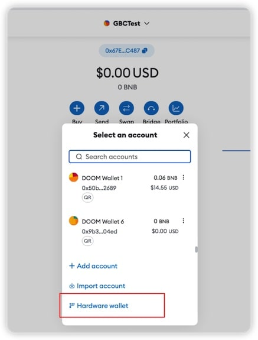

# Doom Wallet

Doom Wallet is a mobile cold wallet. You can use it to secure your private keys and sign transactions offline. It's supposed to be used in a dedicated offline device.

You need to use Doom Wallet with an online wallet, like [MetaMask](https://metamask.io/), to send transactions to the network. You can use the QR code scanner to scan the transaction data from the online wallet, sign it and send it back to the online wallet.

## Why Doom Wallet?

#### 1. open source and react native

Doom Wallet is open source and built with react native. You can check the code and build it yourself.

#### 2. free

Doom Wallet is free. You can use it without paying anything.

#### 3. secure

Doom Wallet can be used on iOS or Android devices. It's safer than other hardware wallets. You can use Biometrics (FaceID or TouchID) to store your private keys. No one can access your private keys without your Biometrics. However, some specific versions of iOS or Android may not be secure enough. Generally, hardware wallets cannot compete with iOS or Android devices regarding security.

#### 4. easy to use

Doom Wallet is easy to use. We are aiming to make a user-friendly wallet.

## Why Doom?

Because we think the hardware wallets are useless. We want to make a free and open-source cold wallet for everyone. Doom Wallet will doom the hardware wallets.

## Password(passphrase)

In Doom Wallet, a private key is generated by a 24-words mnemonic and a password. Without the password, you cannot get the private key.

So, when you back up your wallet, you should back up the mnemonic and the password in different places.

## Supported Chains

- Ethereum
- Binance Smart Chain
- EVM-compatible chains: Polygon, Fantom, Avalanche, etc. Not tested yet. If you meet any problems, please open an issue.

We will support Bitcoin and other chains in the future.

## How to use Doom Wallet?

#### 1. Use MetaMask

[MetaMask](https://metamask.io/)

You must have an online wallet to use Doom Wallet. We recommend MetaMask.

#### 2. Create a new wallet

2.1 Open Doom Wallet; you can create a random mnemonic or hash a given text to generate a mnemonic.

2.2 Then, you can set the password. Passwords should be strong enough. You can use a password manager to generate a strong password.

2.3 Then, in the security settings, you can use Biometrics to encrypt your private keys. If you decide to use Biometrics, you need to use Biometrics to unlock your wallet every time you open Doom Wallet.

The most secure way to use Doom Wallet is to use Biometrics and a strong password together. The mnemonic will be encrypted by your FaceID or TouchID. You have to type the password whenever you want to use the wallet.

If you trust your device, you can choose to use Biometrics only. This way, the password and mnemonic will be encrypted by your Biometrics and stored on your device.

2.4 Then, you can start to use Doom Wallet.

#### 3. Get Connection QR Code

Click the "Account" tab and click "Connection QR Code".

The Doom Wallet will show a QR code. Then, you need to use Metamask to scan this QR code.

#### 4. Connect to MetaMask

In MetaMask, you need to click "Account." and then click "Hardware wallet":

Then, you need to choose "QR Based" and click "Continue".

Then, MetaMask will ask you to scan the QR code. The browser may ask for the camera's permission.

You will see an address list if MetaMask scans the QR code successfully.

The Doom Wallet is an HD (Hierarchical Deterministic) wallet which can control many addresses derived from one private key. You can learn more about BIP32. So, you will use the derived addresses. You can choose one of them to connect to MetaMask. Then, you can click unlock to unlock the wallet.

Then, you will see your derived address in the MetaMask.

#### 5. Send transactions

Here, we use Binance Smart Chain as an example because of the low transaction fee.

5.1 In MetaMask, you need to click "Send".

5.2 Then, you review the transaction and click "Next" and "Confirm".

It will show a QR code. You need to scan this QR code with Doom Wallet.

5.3 In Doom Wallet, you need to click "Scan QR Code" and scan the QR code.

Scan that QR code.

You can review the transaction data.

If you think it's correct, you can click "Sign" to sign the transaction. Then, you will get a signed QR code.

5.4 Then, you need to scan the signed QR code with MetaMask.

5.5 Then, the transaction is sent to the network.

