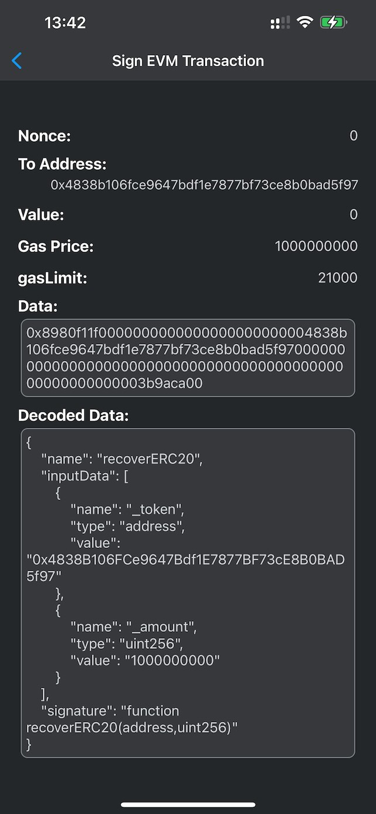
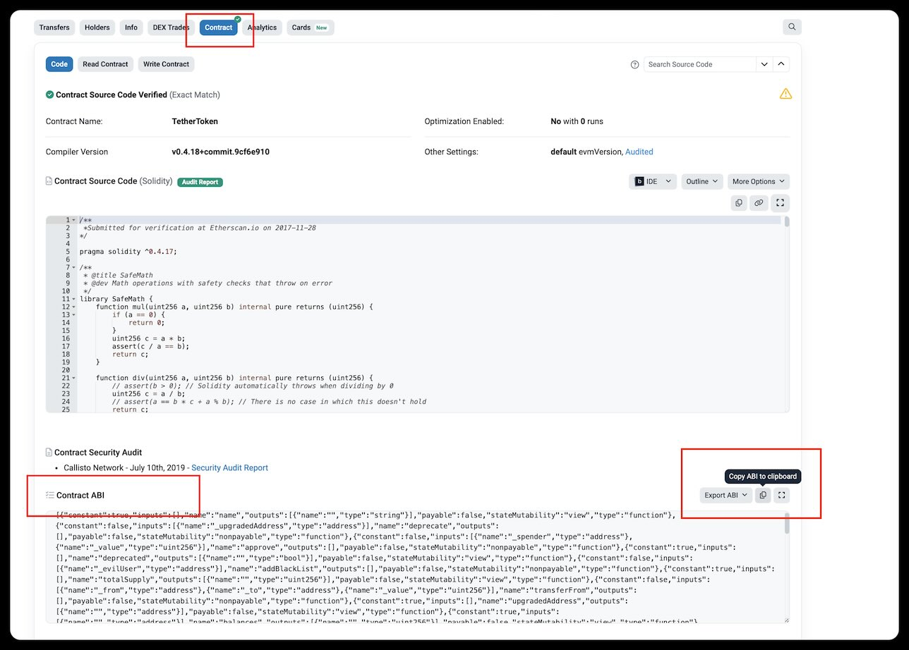
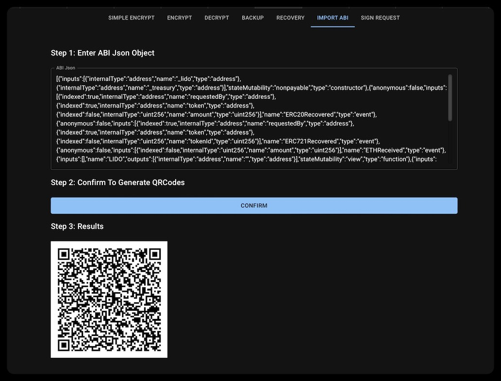
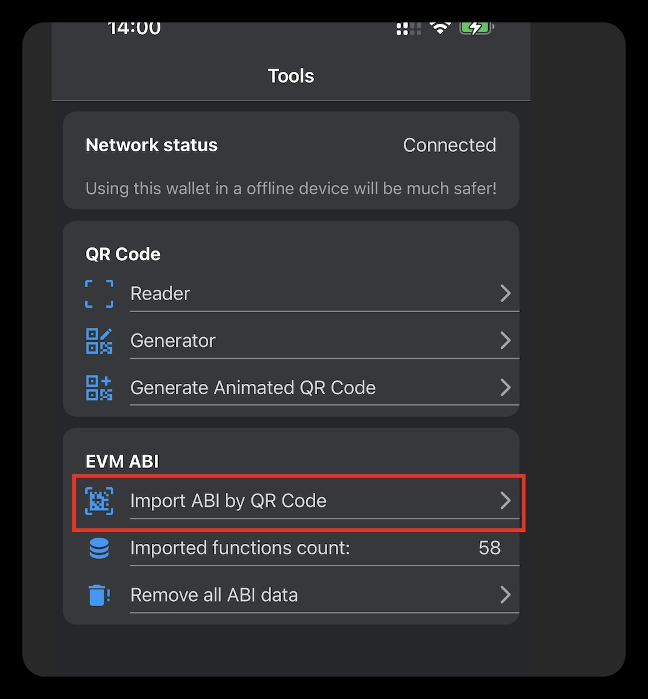

# EVM Contract ABI

The contract ABI is a JSON file that defines how to interact with a contract. It specifies the function signatures (the function name and the parameters) and the return types. The contract ABI is used to encode and decode the function calls and responses.

Doom Wallet supports the EVM contract ABI. You can import the ABI file to check the sign request's function name and parameters. During the sign request, you can see the decoded data:

Here are the steps to import the ABI file:

## 1. Find Contract ABI

You can find the Contract ABI by Block Explorer or the contract's source code. For example, you can find some verified Ethereum contracts' ABI on [Etherscan](https://etherscan.io/):

- You need to find the contract address, like this one: https://etherscan.io/token/0xdac17f958d2ee523a2206206994597c13d831ec7#code
- Click the "Contract" tab, and you can find the "Contract ABI" section.
- Copy the ABI JSON string.

## 2. Generate QR Code

You can use the online tool, [Doom-tools](https://doom-helper.netlify.app/import-abi), to generate the QR code for the ABI JSON string.

- Paste the ABI JSON string.
- Click the "Generate" button.
- You can see the QR code.

## 3. Import ABI on Doom Wallet

You can import the ABI file by scanning the QR code. Click the "Import ABI" button.

- Click the "Tools" button from the bottom tabs.
- Click the "Import ABI by QR Code" button.
- Click the "Scan" button to scan the QR code.
- Because the ABI JSON string is too long, we use the animated QR code. The scanning process may take a while.

## 4. Check the ABI

After you import the contract ABI by scanning the QR code, you can see the function names and parameters when you review the sign request.
