# Bitcoin Wallet

## Hot Wallet

We suggest you use Blue Wallet as a hot wallet.

Get Blue Wallet: https://bluewallet.io/

## 1. Get Connection QR Code in Doom Wallet

Click the "Account" tab:

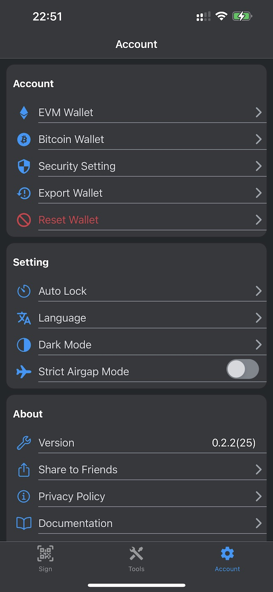

Then, click "BTC wallet":

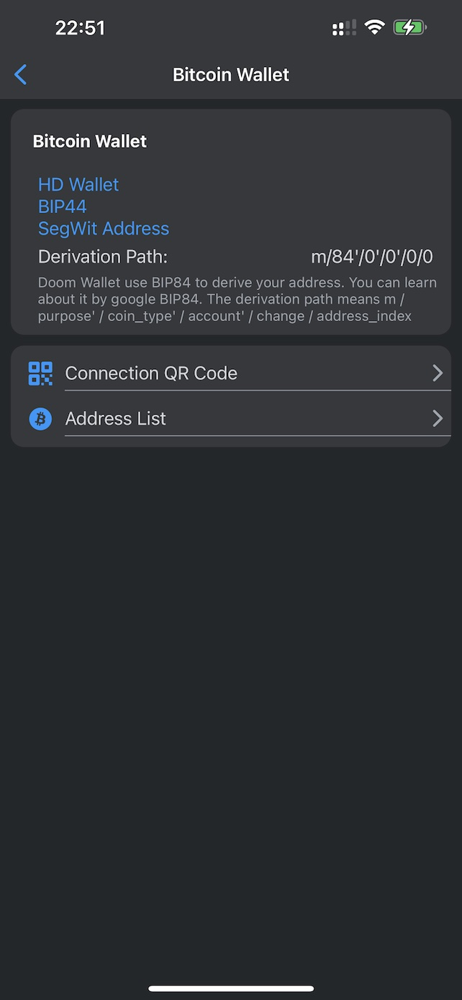

then "Connection QR Code".

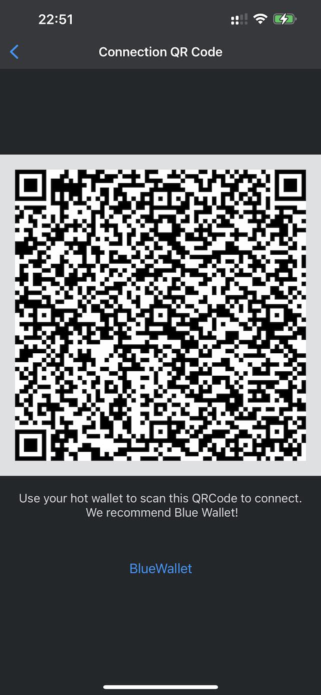

You need to import account by this QR code.

In "Address List", you can see all addresses in this wallet. You can use any address to receive BTC.

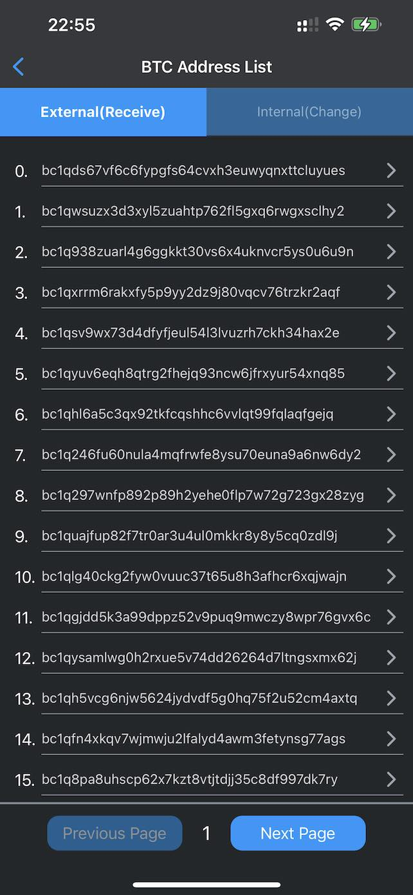

Doom Wallet and Blue Wallet will use [BIP84](https://github.com/bitcoin/bips/blob/master/bip-0084.mediawiki) to manage addresses. If you want to learn more about it, you can google BIP 44, BIP 49, and BIP 84.

And, the addresses (SegWit address) start with bc1.

## 2. Import Account to Blue Wallet

Using Blue Wallet.

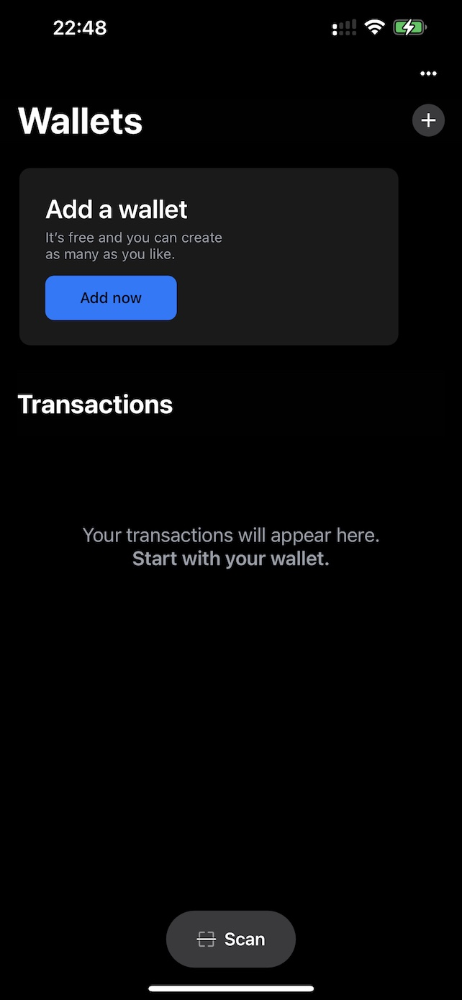)

You need to click the "Add now" button to add a wallet.

Then, select "Import Wallet":

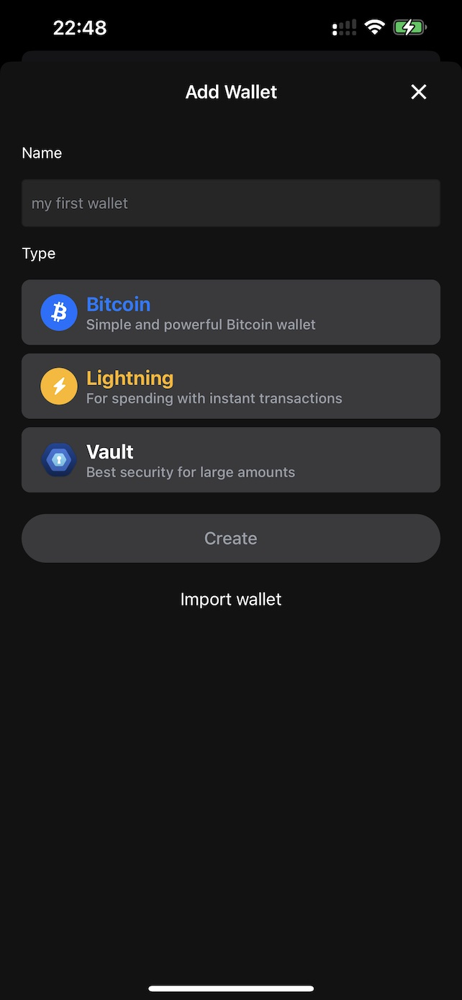

Then, you need to choose "Scan or import a file":

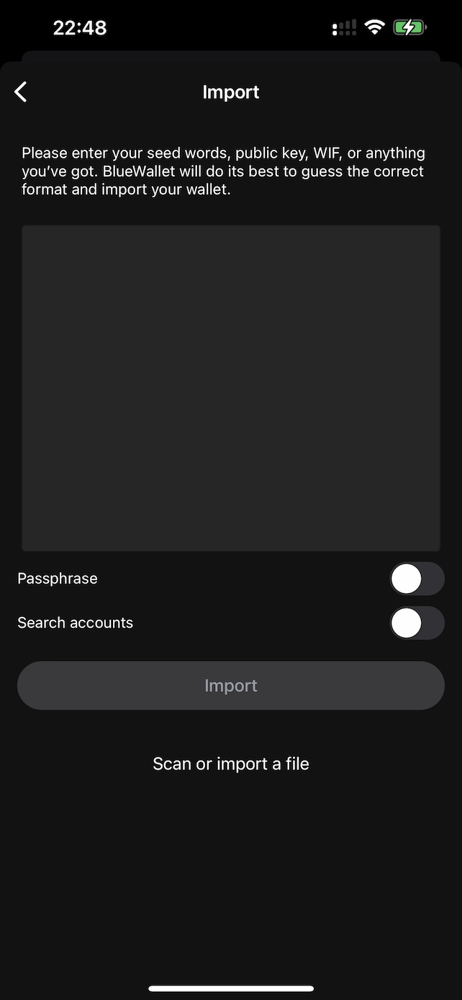

Then, you need to scan the QR code generated by Doom Wallet. After scanning the QR code, you will see the account in Blue Wallet.

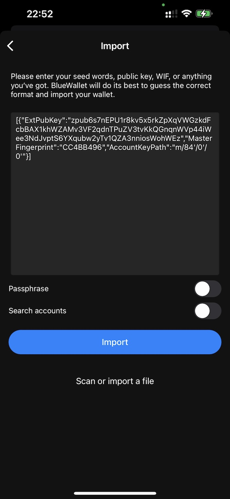
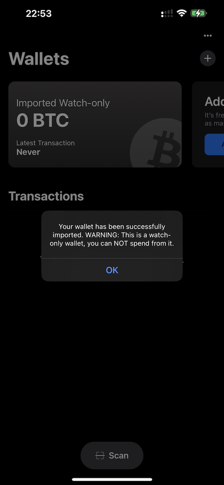

Because it is a watch-only wallet, you can't send transactions in Blue Wallet. You can use Doom Wallet to sign transactions. And you also need to enable "offline signing" in Blue Wallet.

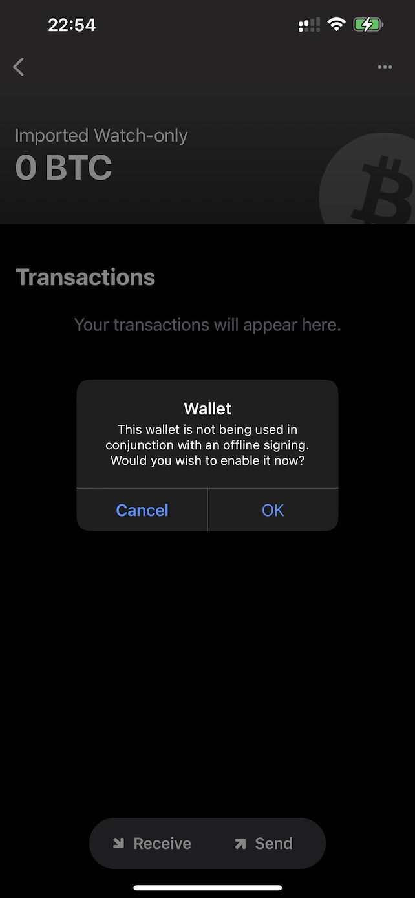

It equals the "Use with hardware wallet" option:

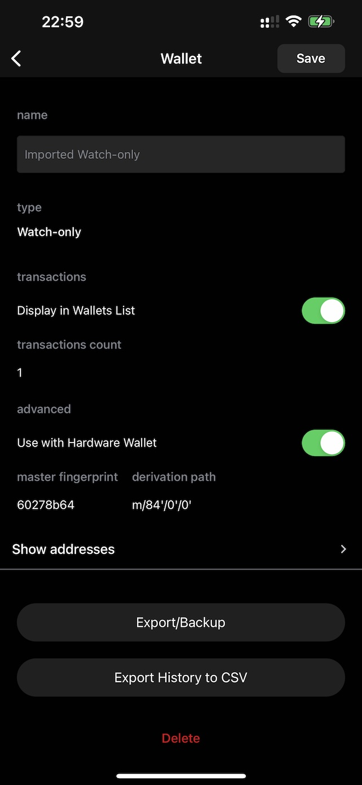

Now, you can send transactions in Blue Wallet.

## 3. Sign Transactions

In Blue Wallet, you need to click the "Send" button and edit the transaction:

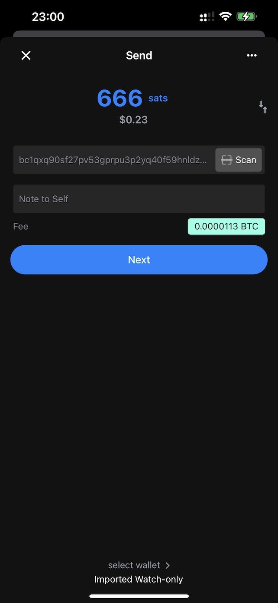

Then, you will see a animated QR code after you click the "Send" button:

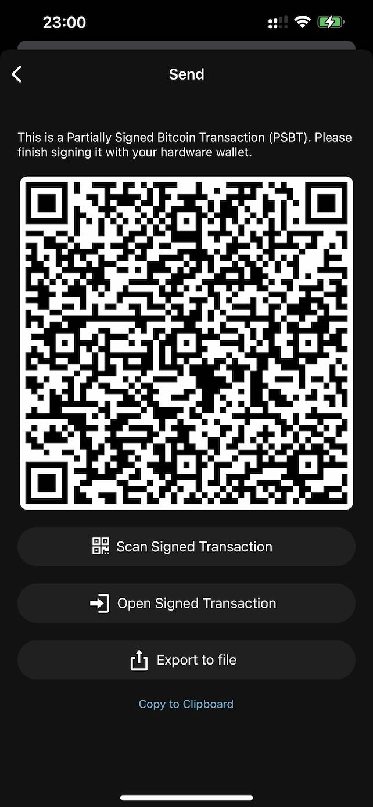

Then, change to Doom Wallet and click the "Scan QR Code" button:

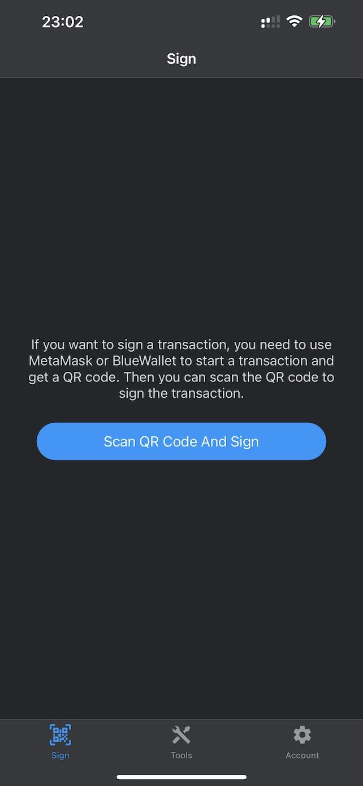

Then, After scanning the QR code, you can review the transaction data:

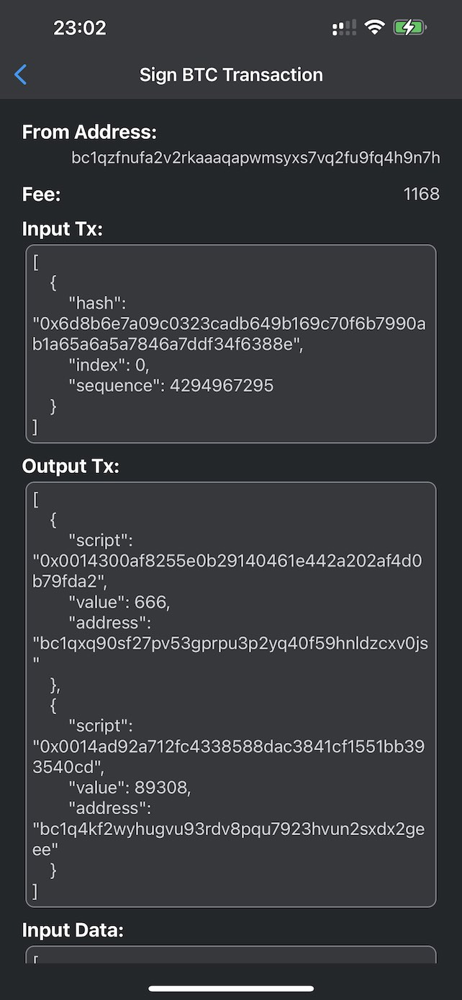

There is a "Sign" button. You need to click it to sign the transaction:

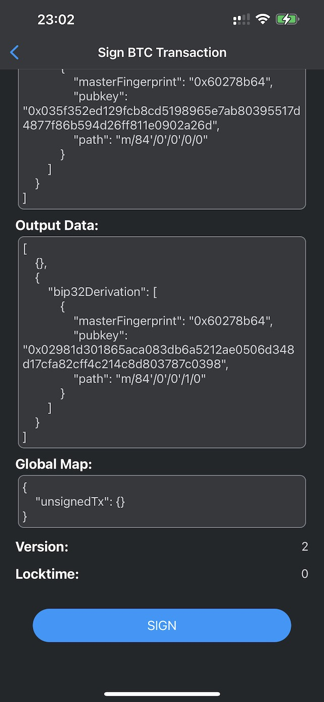

Then, you will get a signed QR code:

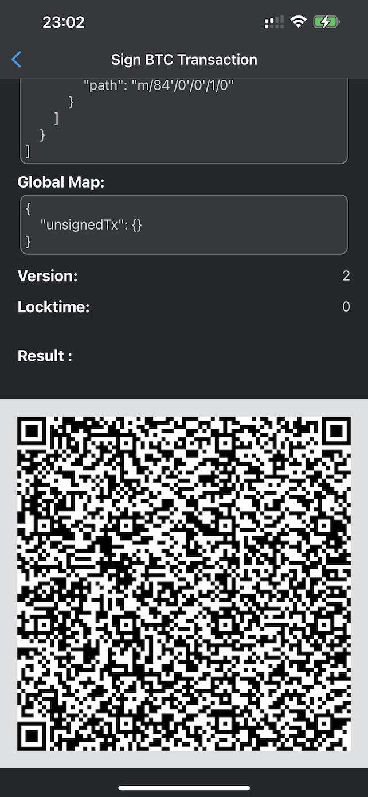

At last, change to Blue Wallet and scan the signed QR code:

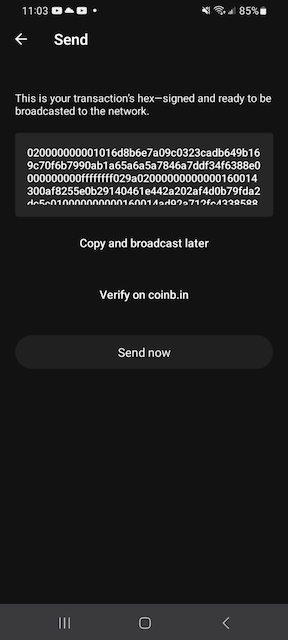

Then, you can click the "Send now" button to send the transaction.
