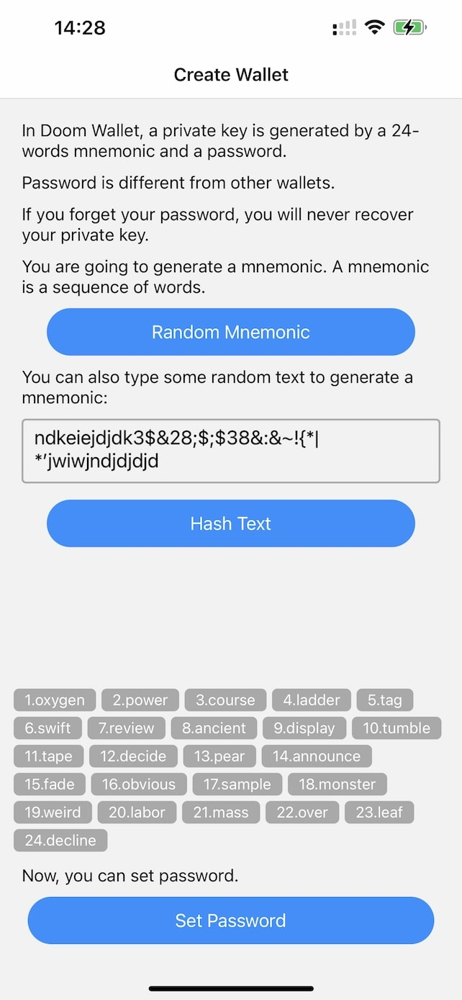
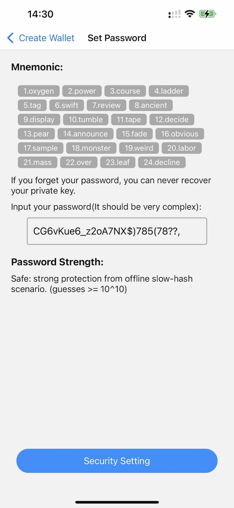
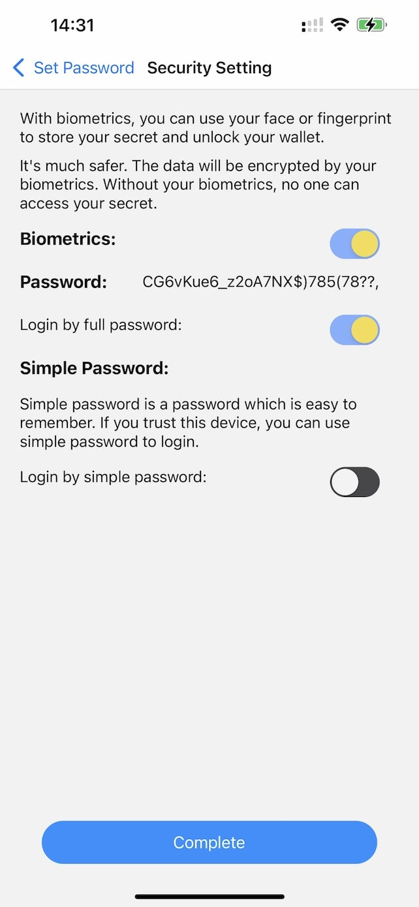

### 1 Open Doom Wallet; you can create a random mnemonic or hash a given text to generate a mnemonic.

### 2 Then, you can set the password. Passwords should be strong enough. You can use a password manager to generate a strong password.

### 3 Then, in the security settings, you can use Biometrics to encrypt your private keys. If you decide to use Biometrics, you need to use Biometrics to unlock your wallet every time you open Doom Wallet.

The most secure way to use Doom Wallet is to use Biometrics and a strong password together. The mnemonic will be encrypted by your FaceID or TouchID. You have to type the password whenever you want to use the wallet.

If you trust your device, you can choose to use Biometrics only. This way, the password and mnemonic will be encrypted by your Biometrics and stored on your device.

### 4 Then, you can start to use Doom Wallet.
