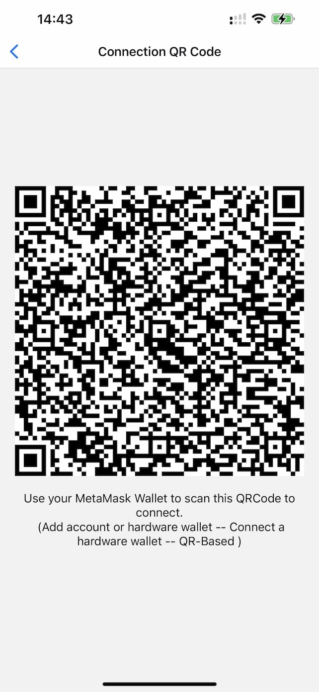
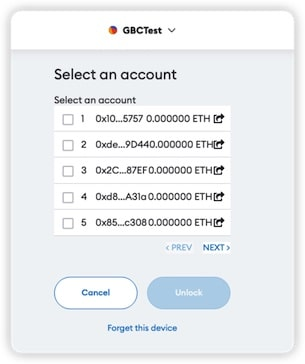
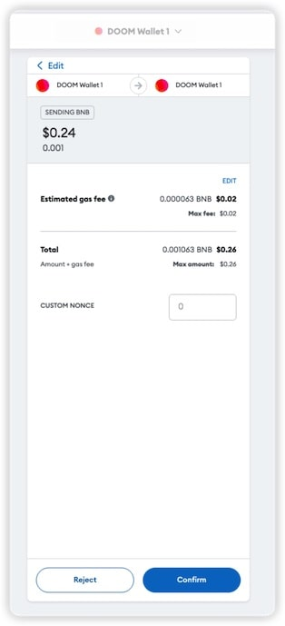
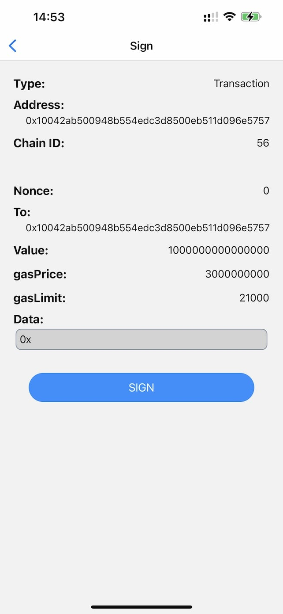
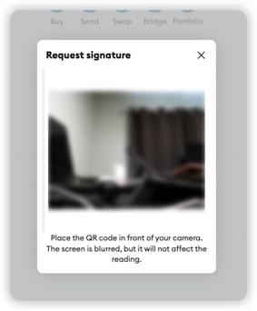
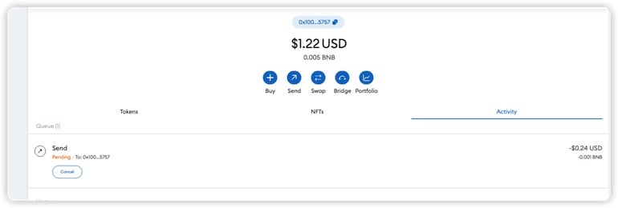

# EVM Wallet User Guide

#### 1. Use MetaMask

[MetaMask](https://metamask.io/)

You must have an online wallet to use Doom Wallet. We recommend MetaMask.

#### 2. Get Connection QR Code

Click the "Account" tab and click "Connection QR Code".

The Doom Wallet will show a QR code. Then, you need to use Metamask to scan this QR code.

#### 3. Connect to MetaMask

In MetaMask, you need to click "Account." and then click "Hardware wallet":

Then, you need to choose "QR Based" and click "Continue".

Then, MetaMask will ask you to scan the QR code. The browser may ask for the camera's permission.

You will see an address list if MetaMask scans the QR code successfully.

The Doom Wallet is an HD (Hierarchical Deterministic) wallet which can control many addresses derived from one private key. You can learn more about BIP32. So, you will use the derived addresses. You can choose one of them to connect to MetaMask. Then, you can click unlock to unlock the wallet.

Then, you will see your derived address in the MetaMask.

#### 4. Send transactions

Here, we use Binance Smart Chain as an example because of the low transaction fee.

4.1 In MetaMask, you need to click "Send".

4.2 Then, you review the transaction and click "Next" and "Confirm".

It will show a QR code. You need to scan this QR code with Doom Wallet.

4.3 In Doom Wallet, you need to click "Scan QR Code" and scan the QR code.

Scan that QR code.

You can review the transaction data.

If you think it's correct, you can click "Sign" to sign the transaction. Then, you will get a signed QR code.

4.4 Then, you need to scan the signed QR code with MetaMask.

4.5 Then, the transaction is sent to the network.

