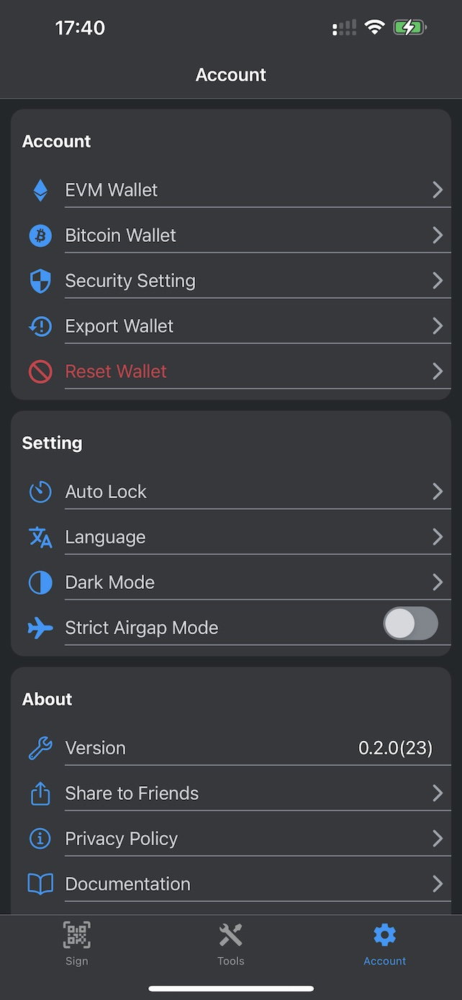
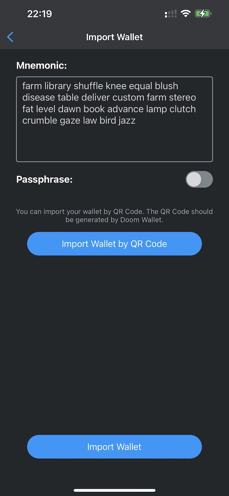

# Import and Export wallet

## Export Wallet

Click the "Account" tab and click "Export Wallet".

You can export your wallet by your mnemonic and password here.

### by QR code

You can export your wallet by QR code. Click "Export Wallet by QR Code" button.

Doom wallet require you to use a password to encrypt your exported data. So the QR code is encrypted. If the password is complex enough, no one can know the actual mnemonic even they got this QR code.

After you set a password, you can click the "Generate" button to generate a QR code.

You can scan the QR code to import your wallet by using Doom Wallet on another device.

## Import Wallet

When you set up your wallet, you can click the "Import Wallet" button to import your wallet.

### by QR code

You can import your wallet by QR code. Click "Import Wallet by QR Code" button.

Then, you need to scan your QR code generated by Doom Wallet.

After scanning the QR code, you need to type the password to decrypt the QR code. Without the password, you can't import the wallet.

After you type the password, you can click the "Unlock" button to get your mnemonic.

Then, you can click the "Import Wallet" button to import your wallet.

Then, you need to finish the security settings before you can use your wallet.

### by mnemonic

You can import your wallet by mnemonic and passphrase. Passphrase is used to generate the private key with mnemonic.

If your old wallet doesn't have a passphrase, you can turn of passphrase option.

Then, you can click the "Import Wallet" button to import your wallet.

If your old wallet doesn't have a passphrase, you need to create an Unlock Password if you want to import it to Doom Wallet. The Unlock Password is used to encrypt your mnemonic. If you forget the Unlock Password, you need to import your wallet again.

Then, you need to finish the security settings before you can use your wallet.
